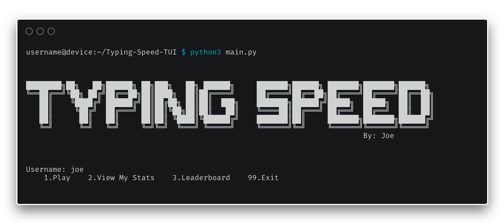
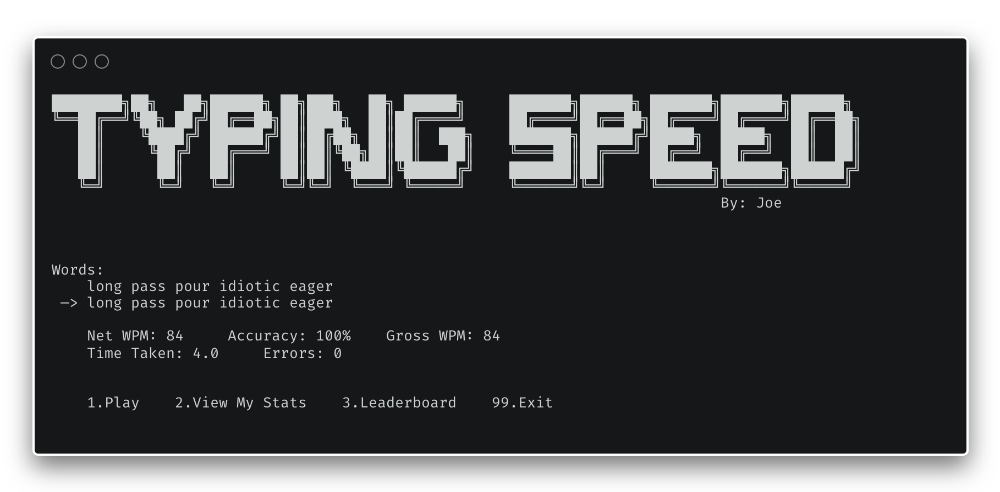
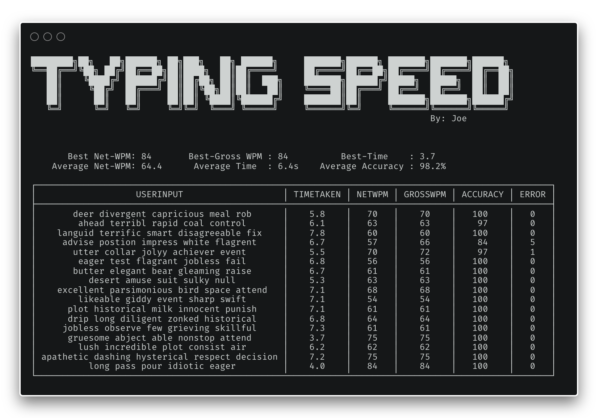

# Typing-Speed-TUI

A simple typing speed test program that uses python and only built-in libraries. It has a user-wise
data recording and the ability to view previous sessions and best runs and times. It even has a leaderboard
feature to view the player with best stats


## Features

- Uses the console
- Menu Driven
- Fast as no GUI is used
- Capability to store and view previous runs
- User-wise records
- Leaderboard
- Ability to view data in the form of a clean and readable table

## How to use:
clone the repo into a directory

In the terminal use the following command
```bash
$ python3 main.py 
```
Enter username and begin playing by typing in any of the following 
- `p`
- `1`
- `play`

the words will show and you can start typing after a 1-second delay

### Images





#### *Note*
Its appearance may differ slightly based on the font you use in your terminal

